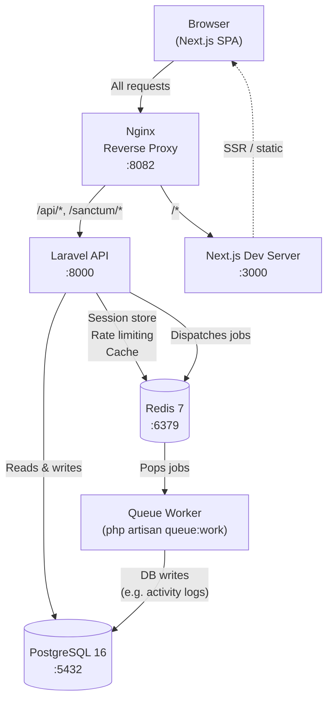
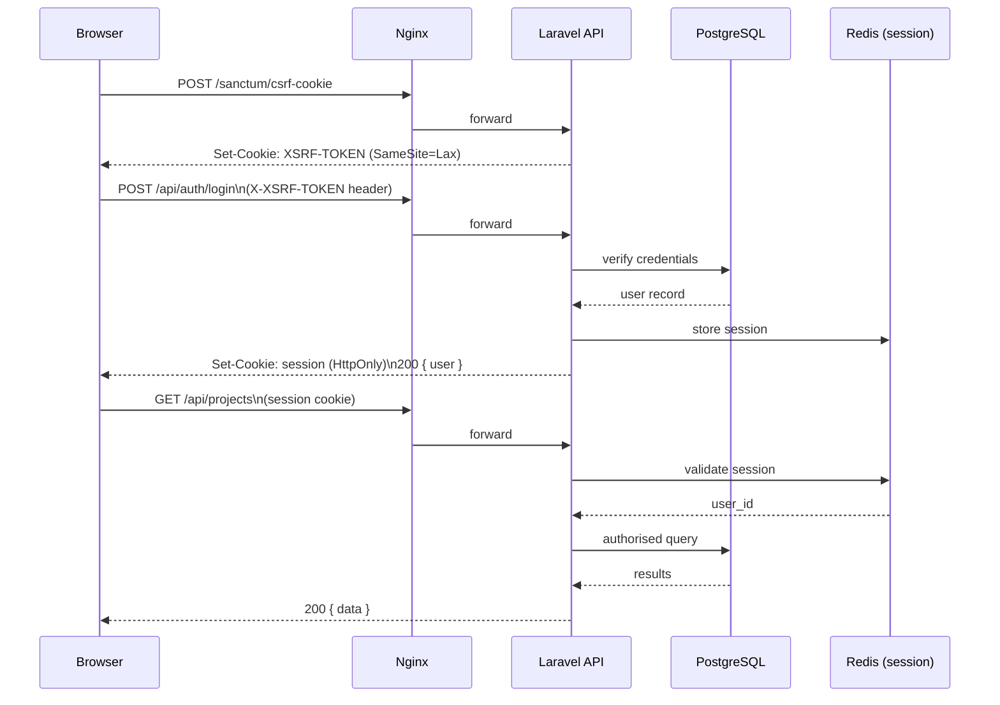
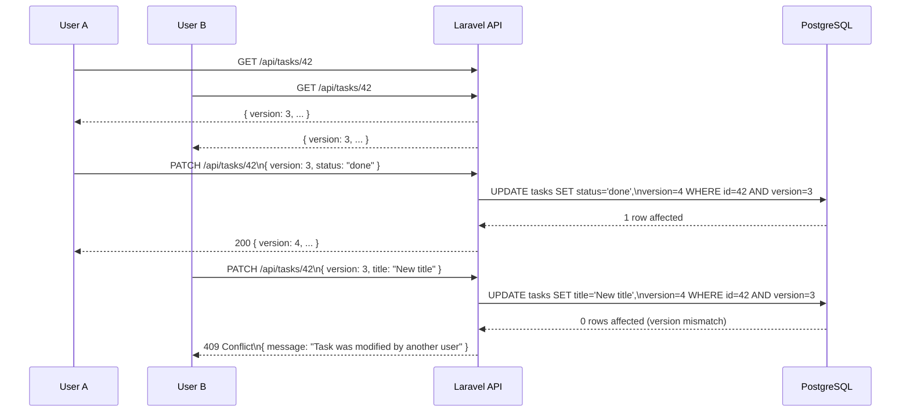
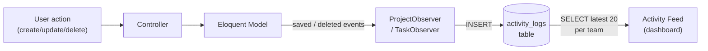

# Data Flow Diagram

## Request / Response Flow

```mermaid
flowchart TD
    Browser["Browser\n(Next.js SPA)"]
    Nginx["Nginx\nReverse Proxy\n:8082"]
    Backend["Laravel API\n:8000"]
    Frontend["Next.js Dev Server\n:3000"]
    PG[("PostgreSQL 16\n:5432")]
    Redis[("Redis 7\n:6379")]
    Worker["Queue Worker\n(php artisan queue:work)"]

    Browser -->|"All requests"| Nginx
    Nginx -->|"/api/*, /sanctum/*"| Backend
    Nginx -->|"/*"| Frontend
    Frontend -.->|"SSR / static"| Browser

    Backend -->|"Reads & writes"| PG
    Backend -->|"Session store\nRate limiting\nCache"| Redis
    Backend -->|"Dispatches jobs"| Redis

    Redis -->|"Pops jobs"| Worker
    Worker -->|"DB writes\n(e.g. activity logs)"| PG
```

## Authentication Flow

```mermaid
sequenceDiagram
    participant B as Browser
    participant N as Nginx
    participant API as Laravel API
    participant DB as PostgreSQL
    participant S as Redis (session)

    B->>N: POST /sanctum/csrf-cookie
    N->>API: forward
    API-->>B: Set-Cookie: XSRF-TOKEN (SameSite=Lax)

    B->>N: POST /api/auth/login\n(X-XSRF-TOKEN header)
    N->>API: forward
    API->>DB: verify credentials
    DB-->>API: user record
    API->>S: store session
    API-->>B: Set-Cookie: session (HttpOnly)\n200 { user }

    B->>N: GET /api/projects\n(session cookie)
    N->>API: forward
    API->>S: validate session
    S-->>API: user_id
    API->>DB: authorised query
    DB-->>API: results
    API-->>B: 200 { data }
```

## Task Update (Optimistic Concurrency)

```mermaid
sequenceDiagram
    participant U1 as User A
    participant U2 as User B
    participant API as Laravel API
    participant DB as PostgreSQL

    U1->>API: GET /api/tasks/42
    U2->>API: GET /api/tasks/42
    API-->>U1: { version: 3, ... }
    API-->>U2: { version: 3, ... }

    U1->>API: PATCH /api/tasks/42\n{ version: 3, status: "done" }
    API->>DB: UPDATE tasks SET status='done',\nversion=4 WHERE id=42 AND version=3
    DB-->>API: 1 row affected
    API-->>U1: 200 { version: 4, ... }

    U2->>API: PATCH /api/tasks/42\n{ version: 3, title: "New title" }
    API->>DB: UPDATE tasks SET title='New title',\nversion=4 WHERE id=42 AND version=3
    DB-->>API: 0 rows affected (version mismatch)
    API-->>U2: 409 Conflict\n{ message: "Task was modified by another user" }
```

## Activity Logging Flow

```mermaid
flowchart LR
    Action["User action\n(create/update/delete)"] --> Controller
    Controller --> Model["Eloquent Model"]
    Model -->|"saved / deleted events"| Observer["ProjectObserver\n/ TaskObserver"]
    Observer -->|"INSERT"| ActivityLog[("activity_logs\ntable")]
    ActivityLog -->|"SELECT latest 20\nper team"| Feed["Activity Feed\n(dashboard)"]
```
